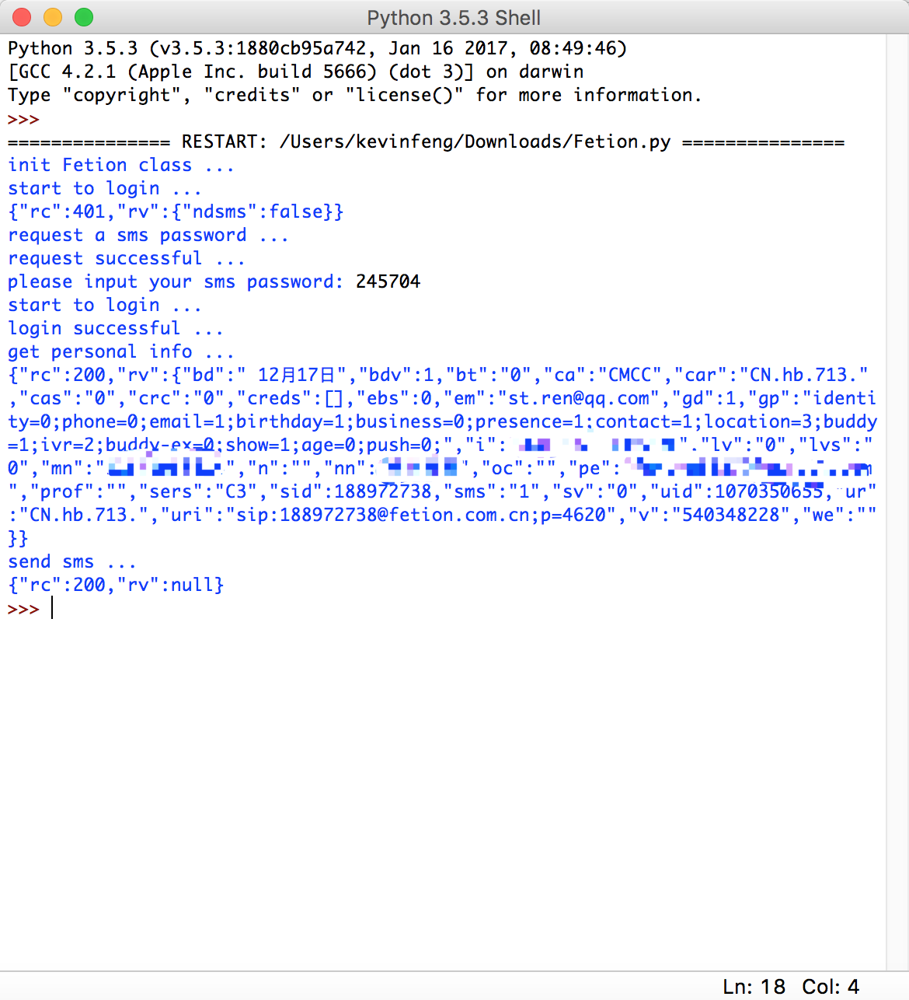

##  Python3发送Fetion短信  

使用方法：
  
  * ***前提*** 使用移动号码注册成为飞信用户
  * 修改源码中的<code>self.name</code>为自己的手机号码
  * 第一次执行不需要在源码中填写短信密码<code>self.password</code>
  * 短信密码时效30分钟，想play多次，可以直接将手机收到的短信密码填入源码
  * ***注意*** 只支持Python3
  
使用效果：
   
  
  
  
  
  
    
  

